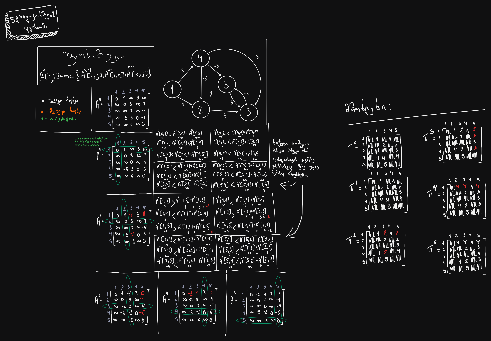

# ფლოიდ-ვორშელის ალგორითმით იპოვეთ და ააგეთ უმოკლესი გზები შემდეგ ორიენტირებულ გრაფში

```V = {1,2,3,4,5}```
```E = {(1,2)_1, (1,4)_3, (2,3)_3, (2,5)_7, (3,5)_-4, (4,2)_-5, (4,5)_-3, (4,3)_3, (5,3)_6}.```

- V არის წვეროები.
- E არის წიბოები, დაბლითა ტირეს გვერძე მოცემული რიცხვი არის წიბოს წონა.

თუ კარგად არ ჩანს და გსურთ რომ დეტალურად გადახედოთ, გადადით ამ [ბმულზე .](https://www.tldraw.com/ro/weSNmoypMwqks26VLep-I?d=v-100.61.3890.2705.page "https://www.tldraw.com/ro/weSNmoypMwqks26VLep-I?d=v-100.61.3890.2705.page") ან გახსენით ეს [ფოტო რომელიც შენახულია ამ პროექტში](Floyd-Warshall.png).
___
### ფსევდოკოდი

>[!CAUTION]
>ეს ნაწილი არ არის აუცილებელი ამ კითხვისთვის, არის მარტო ინტერესისთვის.

```cpp
#include <iostream>
#include <limits>

int main()
{
    int INF = std::numeric_limits<int>::max();
    int size = 5;
    
    int W[5][5]={
        0, 1, INF, 3, INF,
        INF, 0, 3, INF, 7,
        INF, INF, 0, INF, -4,
        INF, -5, 3, 0, -3,
        INF, INF, 6, INF, 0
    };
    
    for(int k = 0; k < size; k++){
        for(int i = 0; i < size; i++){
            for(int j = 0; j < size; j++){
                if (W[i][j] > (W[i][k] + W[k][j]) && (W[k][j] != INF && W[i][k] != INF))
                    W[i][j] = W[i][k] + W[k][j];
            }
        }
    }
    
    for(int i = 0; i< size; i++){
        std::cout << '\n';
        for(int j = 0; j < size; j++){
            std::cout<<W[i][j]<< ' ';
        }
    }
}
```
